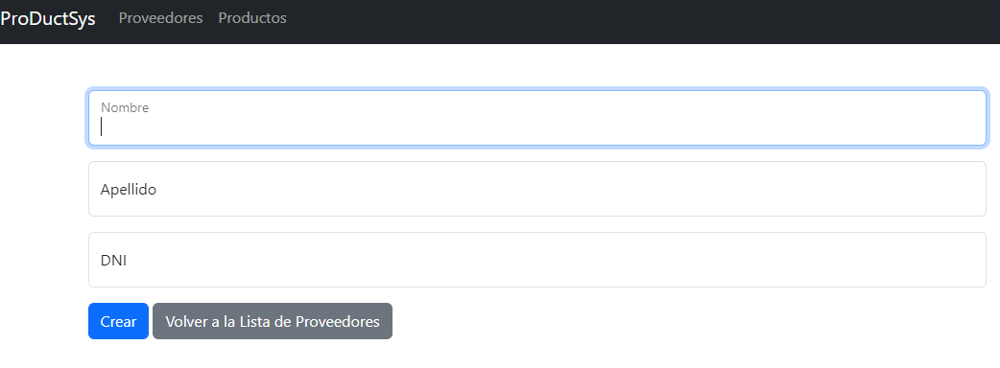
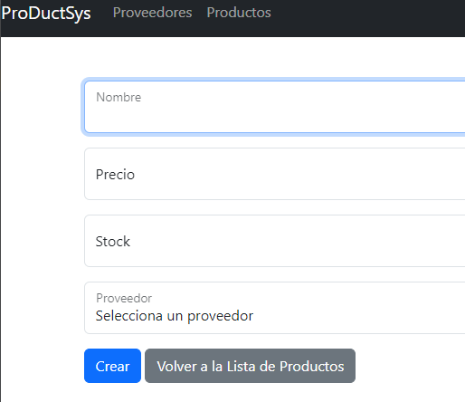
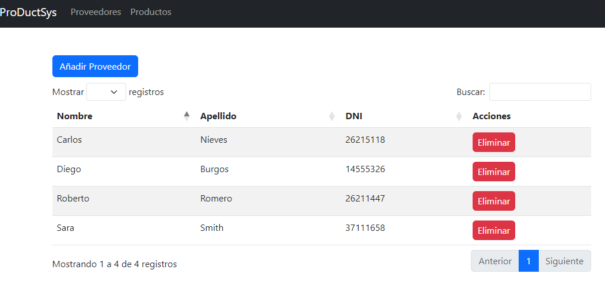
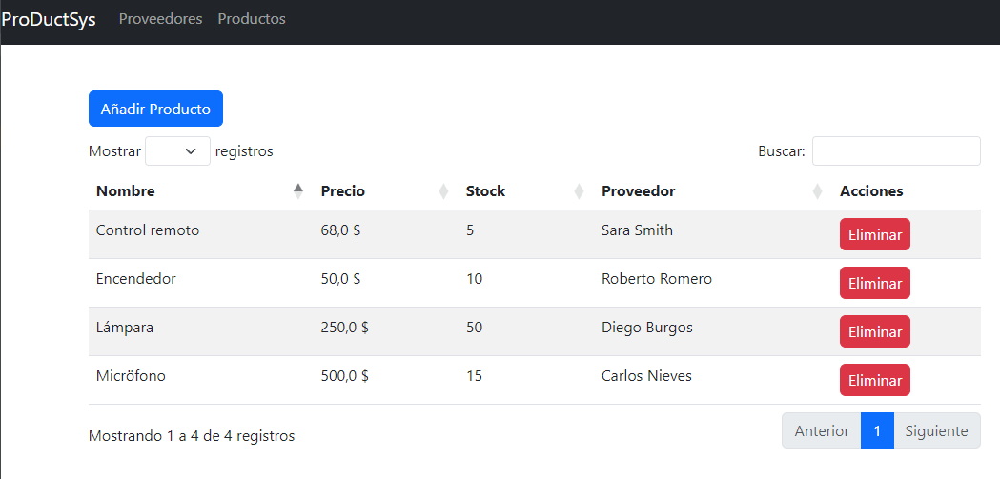

# ProDuctPro

Este proyecto de Django es una aplicación que permite gestionar productos y proveedores. Proporciona funcionalidades básicas como la creación, y eliminación de productos, así como la gestión de proveedores asociados a esos productos.

## Instalación

1. Clonar el repositorio

```bash
git clone https://github.com/santiemanuel/ProDuctSys.git
```

Para instalar el proyecto, se recomienda crear un entorno virtual en PyCharm, y posteriormente instalar las dependencias del proyecto. Para ello, se puede utilizar el archivo requirements.txt que se encuentra en la raíz del proyecto.

```bash
pip install -r requirements.txt
```

2. Crear la base de datos

```bash
python manage.py migrate
```

3. Crear un superusuario

```bash
python manage.py createsuperuser
```

4. Ejecutar el servidor

```bash
python manage.py runserver
```

## Estructura del proyecto

El proyecto cuenta con una aplicación llamada productpro que cuenta con los modelos Product y Provider. La estructura del proyecto es la siguiente:

```bash
├───productpro
│   ├───forms/
│   ├───migrations/
│   ├───models/
│   ├───templates/
│   ├───views/
│   ├───__init__.py
│   ├───admin.py
│   ├───apps.py
│   ├───models.py
│   ├───tests.py
│   └───urls.py
├───stockcontrol/
│   ├───__init__.py
│   ├───asgi.py
│   ├───settings.py
│   ├───urls.py
│   └───wsgi.py
├───templates/
│   ├───base.html
│   ├───datatables.html
│   └───navbar.html
├───db.sqlite3
├───manage.py
└───requirements.txt
```

## URLs del proyecto

El proyecto cuenta con las siguientes URLs:

- `/provider-list`: Lista de proveedores
- `/provider/new`: Creación de proveedores
- `/provider/<int:pk>/delete`: Eliminación de proveedores
- `/product-list`: Lista de productos
- `/product/new`: Creación de productos
- `/product/<int:pk>/delete`: Eliminación de productos

## Funcionalidades

### Creación de proveedores

La creación de proveedores se realiza a través de un formulario que cuenta con los siguientes campos:

- Nombre
- Apellido
- DNI

Imagen del formulario de creación de proveedores:



### Creación de productos

La creación de productos se realiza a través de un formulario que cuenta con los siguientes campos:

- Nombre
- Precio
- Stock
- Proveedor

Imagen del formulario de creación de productos:




### Listado de proveedores

El listado de proveedores se realiza a través de una tabla que se ve a continuación:



### Listado de productos

El listado de productos se realiza a través de una tabla que se ve a continuación:



### Búsqueda

La búsqueda se realiza a través de un campo de texto que se encuentra en la parte superior de la tabla de productos y de proveedores.

### Eliminación de proveedores

La eliminación de proveedores se realiza a través de un botón que se encuentra en la tabla de proveedores.

### Eliminación de productos

La eliminación de productos se realiza a través de un botón que se encuentra en la tabla de productos.

### Paginación

La paginación se realiza a través de un paginador que se encuentra en la parte inferior de la tabla de productos y de proveedores.


## Tecnologías utilizadas

- Python 3.11
- Django 4.2.2
- Bootstrap 5.3.0